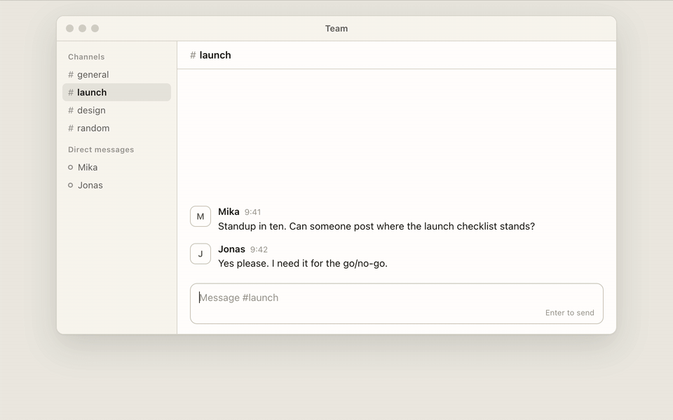
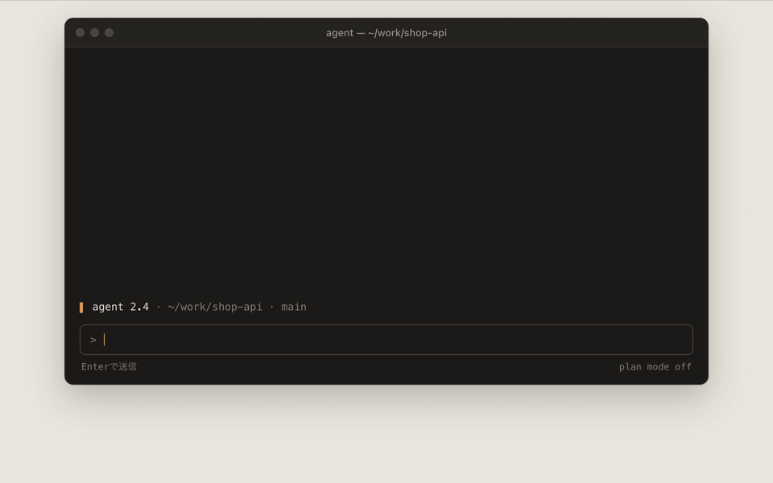

# Outbox

**A scratchpad that disappears when you copy.**

Outbox is a tiny menu-bar app for macOS. Press **⌃⌥Space**, write the long Slack message or AI prompt you did not want to type into a cramped input box, and press **⌘⏎**. The text is on your clipboard and pasted into the app you came from, and the panel is gone.



[Download the latest release](https://github.com/makiren/outbox/releases/latest) · macOS 13 or later · Apple Silicon and Intel · MIT · [日本語](#日本語)

## Why

Chat inputs are a bad place to write anything longer than two lines. Enter sends by accident, the box is small, and a reload eats your draft. Notes apps solve the writing part, but then you have to select, copy, switch, paste, and go back to delete the note.

Outbox is a buffer that sits in front of the clipboard, and it collapses all of that into one keystroke each way. Write, copy, gone.

## Where it helps

- **Team chat.** Slack, Teams, Discord: anywhere Enter means "send". In Outbox, Enter is only a new line.
- **AI prompts.** In a chat window or in a terminal, where Enter submits too: write the multi-paragraph prompt with its context first, then hand it over in one paste.
- **Forms that forget.** Comment boxes and web forms lose text on reload. The Outbox draft is saved to disk as you type.
- **Plain text.** Outbox holds plain text only, so whatever you paste through it comes out without formatting.



## How it works

- **⌃⌥Space** opens a floating panel with your draft (or an empty one). Outbox becomes the active app while the panel is open.
- **⌘C** or **⌘X** with *nothing selected* copies or cuts the *whole* text and closes the panel. With a selection they behave normally. **⌘⏎** and **⇧⌘⏎** do the same regardless of selection.
- On close, focus goes back to the app you came from, and Outbox sends **⌘V** there (optional, needs Accessibility permission).
- **Esc** hides the panel and keeps the draft. The draft is saved to disk as you type, so it survives restarts.
- The panel can be moved and resized, and it reopens where you left it. It shows up on whichever Space you are on, including over full-screen apps.

| Action | Shortcut |
| --- | --- |
| Open / hide the panel | ⌃⌥Space |
| Copy everything and close | ⌘⏎, or ⌘C with no selection |
| Cut everything and close | ⇧⌘⏎, or ⌘X with no selection |
| Hide and keep the draft | Esc or ⌘W |
| Quit | ⌘Q from the menu-bar icon |

## Install

Requires macOS 13 or later. The release build is a universal binary (Apple Silicon and Intel).

1. Download `Outbox-<version>.zip` from [Releases](../../releases) and unzip it.
2. Move `Outbox.app` to `/Applications` and open it. An icon appears in the menu bar. Nothing appears in the Dock.
3. Optional: add Outbox to **System Settings → General → Login Items** so it starts at login.

### "Apple could not verify Outbox"

Outbox is signed ad hoc, not notarized, so Gatekeeper refuses it on first launch. Either

- open **System Settings → Privacy & Security**, scroll down, and click **Open Anyway**, or
- clear the quarantine flag in a terminal:

```sh
xattr -dr com.apple.quarantine /Applications/Outbox.app
```

### Paste-back needs Accessibility

The first time you press ⌘⏎, macOS asks for Accessibility permission so Outbox can send ⌘V to the previous app. Grant it under **System Settings → Privacy & Security → Accessibility**. Without it, the text is still on the clipboard; you just paste yourself. Paste-back can be turned off from the menu-bar icon.

After updating to a new version, paste-back may stop working: the app is signed ad hoc, so macOS can treat the new build as a different app. Remove Outbox from the Accessibility list and add it again.

## Configuration

There is no settings window. Everything is a `defaults` key. Restart Outbox after changing the hotkey.

| Key | Default | Meaning |
| --- | --- | --- |
| `pasteBack` | `true` | Send ⌘V to the previous app after copying |
| `monospace` | `false` | Use the system monospaced font instead of SF Pro |
| `hotKeyCode` | `49` (Space) | Virtual key code of the hotkey |
| `hotKeyModifiers` | `6144` (⌃⌥) | Carbon modifier mask: ⌘ 256, ⇧ 512, ⌥ 2048, ⌃ 4096. Add them up. |

```sh
# Example: ⌥⌘Space
defaults write tokyo.initie.outbox hotKeyCode -int 49
defaults write tokyo.initie.outbox hotKeyModifiers -int 2304

# Monospaced font
defaults write tokyo.initie.outbox monospace -bool true
```

The draft lives at `~/Library/Application Support/Outbox/draft.md`.

## Build from source

Xcode command line tools are enough. No third-party dependencies.

```sh
git clone https://github.com/makiren/outbox.git
cd outbox
make install      # builds, copies to /Applications, launches
```

Other targets: `make app` (bundle in `build/`), `make run`, `make release` (universal binary + zip), `make clean`.

The code is about 700 lines of Swift:

| File | Role |
| --- | --- |
| `Sources/Outbox/AppDelegate.swift` | Menu bar item, show/hide, activation hand-off, commit |
| `Sources/Outbox/OutboxPanel.swift` | Borderless vibrancy panel and layout |
| `Sources/Outbox/OutboxTextView.swift` | Copy/cut-to-close logic, shortcuts, placeholder |
| `Sources/Outbox/HotKey.swift` | Global hotkey via Carbon `RegisterEventHotKey` |
| `Sources/Outbox/PasteBack.swift` | ⌘V via `CGEvent` |
| `Sources/Outbox/DraftStore.swift` | Debounced draft persistence |

## Non-goals

Outbox is not a notes app. One draft, no list, no sync, no formatting toolbar. If you want to keep what you wrote, keep it where you pasted it.

## 日本語

Outboxは、SlackやAIチャットに送る長文を先に書いておくための、macOSのメニューバー常駐アプリです。書き終えてコピーすると、パネルは消えます。

- **⌃⌥Space**でパネルを開く
- 書いて **⌘⏎** を押すと、全文がクリップボードに入り、直前のアプリに貼り付けられ、パネルが閉じる。何も選択せずに⌘Cまたは⌘Xを押しても同じ
- パネルの中ではEnterは改行。書いている途中で送信されることはない
- **Esc**を押すと、下書きを残したままパネルが隠れる。下書きは自動で保存される

初回起動時に「開発元を確認できない」と表示されたら、**システム設定 → プライバシーとセキュリティ**の「このまま開く」を押すか、`xattr -dr com.apple.quarantine /Applications/Outbox.app`を実行してください。元のアプリへの自動貼り付けには、アクセシビリティの許可が必要です。ホットキーとフォントの変え方は、上のConfigurationに書いてあります。

日本語の紹介記事は[initieのブログ](https://www.initie.tokyo/blog/outbox/)にあります。

## License

[MIT](LICENSE)
